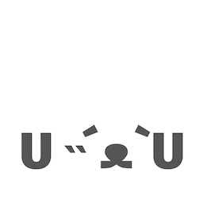

# staark

A set of teeny-tiny libraries for building web apps. The goal of this toolkit is as follows:

- Minimal amount of concepts to learn in order to get going, meaning the system becomes incredibly *easy to reason with*.
- Comes in at a miniscule size when compressed. Due to the minimal philosophy of the library and the simple concepts within the total size is tiny as well.

## Packages

This mono repository contains several packages, see the overview below:

- [`@doars/staark`](https://github.com/doars/staark/tree/main/packages/staark#readme) a teensy-tiny library for for building web apps.
- [`@doars/staark-components`](https://github.com/doars/staark/tree/main/packages/staark-components#readme) a set of components, and a great example for seeing the core library in action.
- [`@doars/staark-isomorphic`](https://github.com/doars/staark/tree/main/packages/staark-isomorphic#readme) a version of staark that can used on the server for rendering a view.
- [`@doars/staark-patch`](https://github.com/doars/staark/tree/main/packages/staark-patch#readme) a version of staark without state management where the node tree is repeatedly patched.
- [`@doars/tiedliene`](https://github.com/doars/staark/tree/main/packages/tiedliene#readme) a teensy-tiny library for managing state diffs.
- [`@doars/vroagn`](https://github.com/doars/staark/tree/main/packages/vroagn#readme) a teensy-tiny library for managing network requests.

## Contributing

If you are using the libraries and are running into an problem that you don't know how to solve, or would love to see a particular feature then feel free to [create an issue](https://github.com/doars/staark/issues/new/choose).

## In the wild

If you are using _staark_ then please let me know, I would love to hear about it!

## Future ideas

- Add support for `memo` nodes to `staark-patch` and `staark-isomorphic`'s patch functions.
- Have the CSV importer of `vroagn` check for a delimiter.
- Add optional key parameter to the `node` function so some nodes are exempt from being re-used during morphing.

## License

[MIT](/LICENSE)
